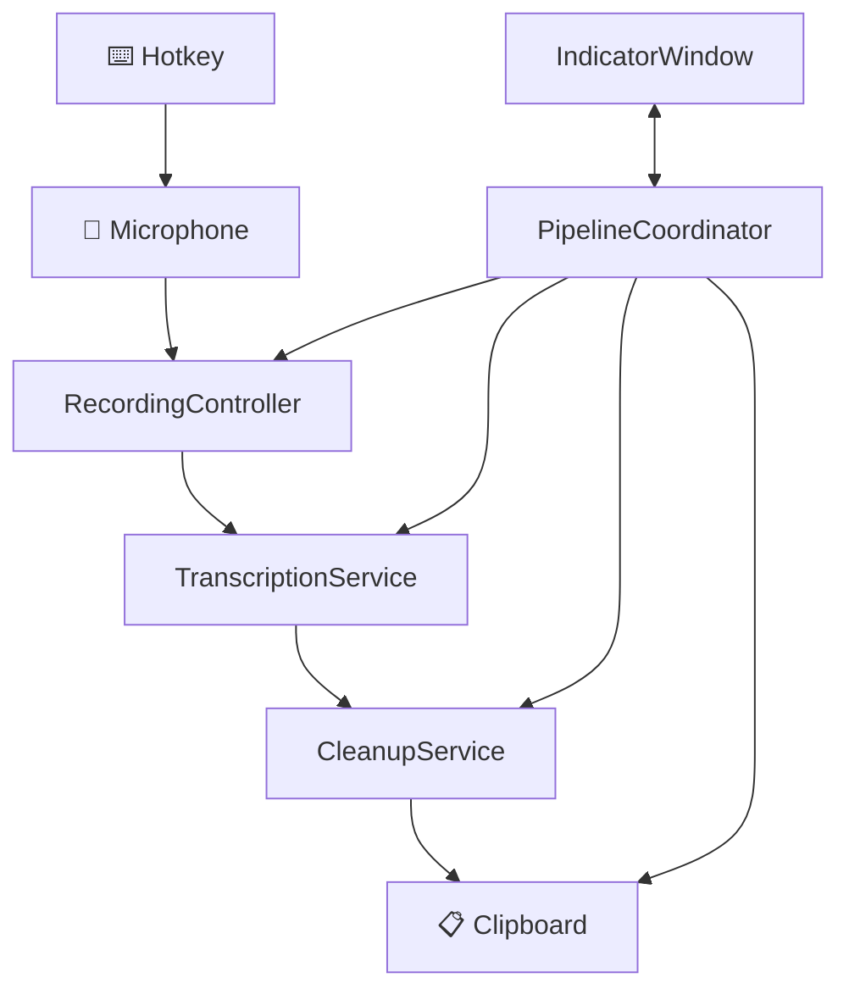

<h1 align="center">Transcriberino</h1>

<p align="center">
  
</p>

<p align="center">
  A lightweight, fully local macOS dictation utility. No cloud, no telemetry, no subscriptions.
</p>

---

## Features

| Feature | Description |
|---------|-------------|
| **Fully Local** | Uses parakeet-mlx running entirely on your machine |
| **Global Hotkey** | Press `⌥` + `D` from anywhere to start/stop recording |
| **Audio-Reactive UI** | Floating indicator with animated visual feedback |
| **Smart Cleanup** | Removes filler words, normalizes formatting |
| **Instant Paste** | Text copied to clipboard, ready to paste |

---

## Quick Start

### 1. Install parakeet-mlx

```bash
uv tool install parakeet-mlx
```

### 2. Build & Run

```bash
swift build && swift run
```

Or open in Xcode:
```bash
open Package.swift
```

### 3. Grant Permissions

On first launch, macOS will prompt for:
- **Microphone** — required for recording
- **Accessibility** — required for clipboard operations

---

## Usage

| Step | Action | Indicator |
|------|--------|----------|
| 1 | Press `⌥` + `D` | 🔴 Listening... |
| 2 | Speak your text | (recording) |
| 3 | Press `⌥` + `D` again | 🟡 Processing... |
| 4 | Text copied to clipboard | 🟢 Ready |
| 5 | `⌘` + `V` to paste | — |

---

## Configuration

Edit `Transcriberino/Config/Config.swift`:

```swift
// Hotkey: ⌥ + D
static let hotkeyKeyCode: UInt32 = UInt32(kVK_ANSI_D)
static let hotkeyModifiers: NSEvent.ModifierFlags = .option

// Transcription
static let parakeetBinaryPath = "~/.local/bin/parakeet-mlx"
static let transcriptionTimeoutSeconds: TimeInterval = 30

// Recording
static let sampleRate: Double = 16000
static let minimumRecordingDuration: TimeInterval = 0.5

// Indicator position
static let indicatorTopOffset: CGFloat = 40
```

---

## Architecture



### Components

| Component | Role |
|-----------|------|
| `HotkeyManager` | Global hotkey (⌥+D) via HotKey library |
| `RecordingController` | AVAudioEngine capture at 16kHz mono |
| `TranscriptionService` | Wraps parakeet-mlx CLI |
| `CleanupService` | Removes filler words, normalizes text |
| `TextInjectionService` | Copies result to clipboard |
| `IndicatorWindow` | Floating audio-reactive UI |

---

## Requirements

- macOS 13.0+ (Apple Silicon)
- parakeet-mlx (`uv tool install parakeet-mlx`)

---

## License

MIT

---

if u get here and read this make sure to say hi to TCHURRI
