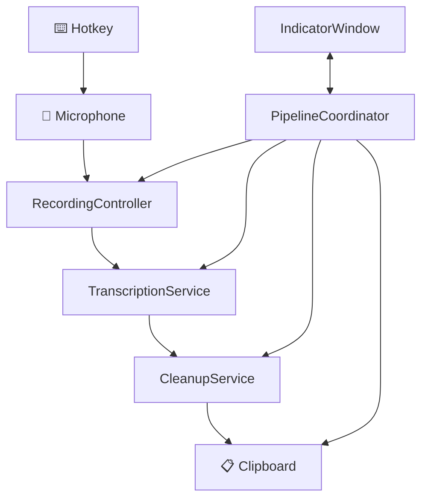

<h1 align="center">Transcriberino</h1>


A lightweight, fully local macOS dictation utility. Press a hotkey to record speech, transcribe it locally with parakeet-mlx, clean the text, and copy it to your clipboard. No cloud, no telemetry, no subscriptions.

## Features

- **Fully local transcription** - Uses parakeet-mlx running on your machine
- **Global hotkey** - Press Option+D from anywhere to start/stop recording
- **Audio-reactive UI** - Visual feedback with a floating indicator
- **Smart text cleanup** - Rule-based cleanup of filler words and formatting
- **Clipboard integration** - Text is copied to your clipboard, ready to paste

## Requirements

- macOS 13.0+
- parakeet-mlx (installed via uv)

## Installation

### 1. Install parakeet-mlx

```bash
uv tool install parakeet-mlx
```

This installs parakeet-mlx to `~/.local/bin/parakeet-mlx`.

### 2. Download a model

parakeet-mlx will automatically download the default model on first run. To use a different model:

```bash
# List available models
parakeet-mlx list-models

# Download a specific model
parakeet-mlx download-model <model-name>
```

### 3. Build & Run

```bash
swift build
swift run
```

Or open in Xcode:

```bash
open Package.swift
```

### 4. Grant Permissions

On first launch, macOS will prompt for:

- **Microphone access** - Required for recording speech
- **Accessibility access** - Required for clipboard operations

Go to **System Settings > Privacy & Security** to grant these if the prompts don't appear.

## Usage

1. Press **Option+D** to start recording - a floating red "Listening..." indicator appears
2. Speak your text
3. Press **Option+D** again to stop - indicator turns yellow "Processing..."
4. Text is cleaned and copied to your clipboard - indicator turns green "Ready"
5. Paste with Cmd+V

## Configuration

Edit `Transcriberino/Config/Config.swift` to customize behavior:

### Hotkey

```swift
static let hotkeyKeyCode: UInt32 = UInt32(kVK_ANSI_D)  // 'D' key
static let hotkeyModifiers: NSEvent.ModifierFlags = .option  // Option+D
```

### Transcription

```swift
static let parakeetBinaryPath = "~/.local/bin/parakeet-mlx"
static let transcriptionTimeoutSeconds: TimeInterval = 30
```

### Recording

```swift
static let sampleRate: Double = 16000  // Audio sample rate
static let minimumRecordingDuration: TimeInterval = 0.5  // Ignore recordings shorter than this
```

### Text Cleanup

```swift
// Text cleanup is rule-based (no configuration needed)
```

Fast mode applies rule-based cleanup:
- Removes filler words (um, uh, like, basically, actually)
- Collapses repeated words
- Normalizes whitespace
- Capitalizes sentences

### Indicator Window

```swift
static let indicatorTopOffset: CGFloat = 40  // Distance from top of screen
static let indicatorCornerRadius: CGFloat = 12
static let indicatorAnimationDuration: TimeInterval = 0.15
```

## Architecture



### Components

| Component | Description |
|-----------|-------------|
| `HotkeyManager` | Global hotkey (Option+D) via HotKey library |
| `RecordingController` | AVAudioEngine capture at 16kHz mono |
| `TranscriptionService` | Wraps parakeet-mlx CLI |
| `CleanupService` | Rule-based filler word removal |
| `TextInjectionService` | Clipboard copy |
| `IndicatorWindow` | Floating audio-reactive UI |

## License

MIT
